## Module Introduction

1. Working with Images & containers
2. Pre-Built & Custom Images
3. Creating & Managing Images

## containers

we don't just have containers, we also have images, when working with Docker. Now, what is the difference, and why do we need both? We already heard about `Containers` in the first course module. You learned that containers in the end are small packages, you could say, that contain both your application, your website, your Node server, whatever it is, and also, and that's important, the entire environment to run that application. So a container is there's a running unit of software. It is the thing which you run in the end. But when working with Docker, we also need dissolver concept called Images, because images will be the templates, the blueprints for containers, it's actually the image, which will contain the code and the required tools to execute the code. And it's the container that then runs and executes the code. And we have this split, this separation here, so that we can create an image with all these setup instructions and all our code once, but then we can use this image to create multiple containers based on that image. So that, for example, if we talk about a Node.js web server application, we can define it once, but run it multiple times on different machines, and different servers. And the image is that sharable package with all the setup instructions and all the code. And the container will be the concrete running instance off such an image. So we run containers, which are based on images. That is the core fundamental concept, Docker is all about in the end. Images and containers, where images are the blueprints, the templates which contained the code and the application, and containers, are then the running application. And this will become clearer throughout this module, once we start working with images and containers, and actually let's start working with that, right now. Let's see how we can work with images, and containers when using Docker.
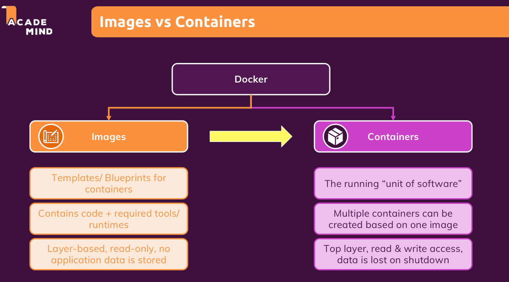
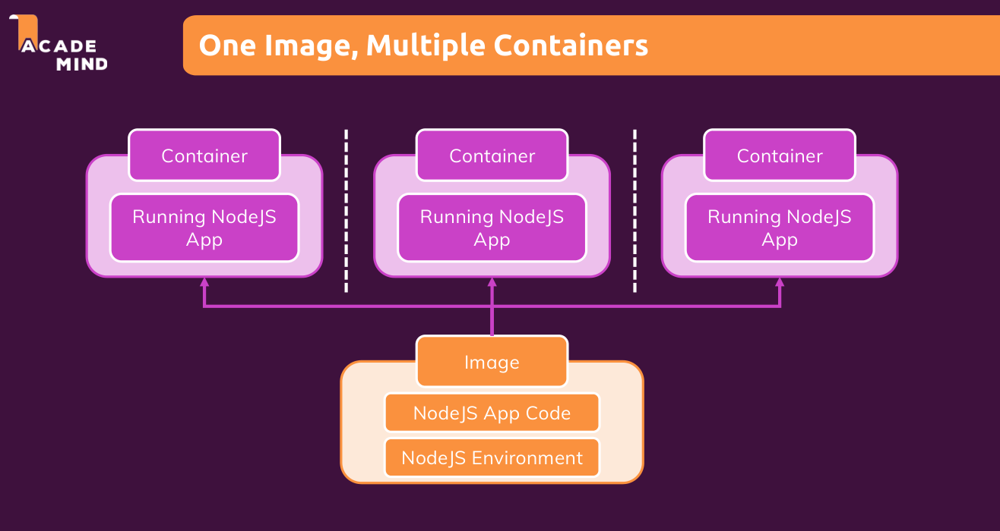

## Using & Running External (Pre-Built) Images

there will be two ways of creating or getting an image so that we then can run a container. The first way is that we use an already existing image. For example, because a colleague of ours already built it, or also very common, because we use one of the official pre-built images or one of the images shared by the community. And a great source for that would be Docker Hub, which you can simply Google to find `hub.docker.com`. And there you can log in but you don't need to do this right now. Instead, here in the search bar, we can, for example, search for `node`. And what we'll find is the official node Docker image, which we could use to build a node application container, a container which will later run a node application. Now this node image which you find on Docker Hub, can be used by anyone and it is distributed and created and maintained by the official node team. Now we will use such official images a lot throughout this course and in general when working with Docker, but we can especially use it right away to get started with images and containers here. And all we need to do for that is open up the command prompt or terminal on your system and then navigate in any folder of your choice and run

```shell
docker run node
```

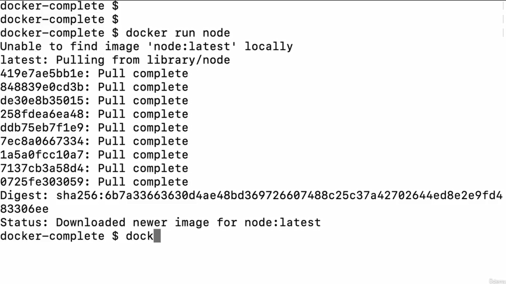
This command here will use this node image which we find on Docker Hub and it will utilize it to create a so called container based on this image, because as I mentioned, containers are really just the running instances of images. Images contain the setup code the environment, in this case, the node image contains the node installation. And then we can run the image to run the application or in this case, to simply run the node interactive shell. Now if you hit Enter, this will give you an error that it doesn't find this image locally, which makes sense because it's on Docker Hub, and then it'll automatically pull it from Docker Hub. So now this downloads the latest node image from Docker Hub and once it downloaded it locally onto our machine, it will run this image as a container. So let's wait for this download to finish here and thereafter, you will see nothing special here. It's done and we can enter more commands. So did we now run the container? Did we now create a container based on an image? Well, yes, we did. But this container isn't really doing much. Node is of course just a software you could say and indeed we can execute node to get an interactive shell where we can insert command. But by default, and that's important, a container is isolated from the surrounding environment and just because there might be some interactive shell running inside of a container does not mean that this shell is exposed to us as a user. Nonetheless, this container was created. And you can tell by running Docker PS dash A.

```shell
docker ps -a
```

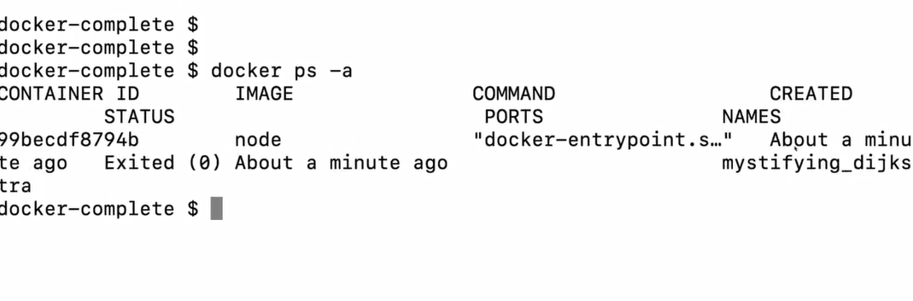
PS stands for processes and with the dash A flag, this will show you all the processes all the containers Docker created for us. And if you hit enter, you will see that a minute ago I actually created a container. And to make this a bit easier to read I'll zoom out a bit and rerun this. And you'll see we created a container with this ID. The image was the node image. It was created two minutes ago, it exited so it's not running anymore and it also received a automatically generated name. We'll dive into names and into configuring containers in general in greater detail later. But what we see is that something happened but that it's not running anymore because as I said a container runs in isolation. And even though we executed node as a image or as a container based on the node image, this alone doesn't do much. Because the interactive shell exposed by node is not automatically exposed by the container to us. That is something we can change though.

```shell
docker run -it node
```

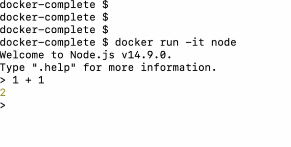

If we repeat the command from before, docker run node, and we now add an extra flag in front of node, the dash IT flag, then we will actually tell Docker that we wanna expose an interactive session from inside the container to our hosting machine. And hence if we now hit enter, we actually are in that interactive node terminal where we can run basic node commands. For example, one plus one, but we could also use node API's in here. But that's of course not the focus of this session. Now the important thing about this here is that node here is now running inside of that created container and it's just exposed to us by adding this extra flag so we can interact with that container and with node running in the container. Node is not running on our machine here and I can prove this. Please note that here we're interacting with node 14.9, which is the version that at the moment I was recording this was pulled into this image, and therefore is being used in this container. Now if I quit this process with Control + C pressed twice now the container will shut down, when I quit this and I run node dash V here like this on my system so not inside of the container, I see 14.7 as a version.
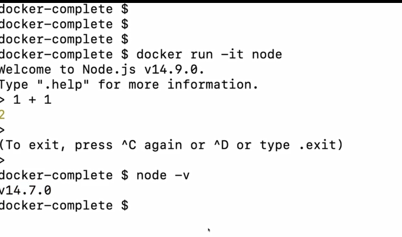

So locally on my system I got a different version installed, then the version we interacted with here, which proves that the version we did interact with must be the version from inside the container. And we don't need node to be installed on our system at all in order to be able to run this node container and interact with it. And that is really how you work with containers. At least these are some first steps of working with containers, and this also shows us what images and containers are. Images are used behind the scenes to hold all the logic and all the code a container needs, and then we create instances of an image with the Run command. This creates then the concrete containers which are based on an image. And if we now run Docker PS dash A again, we see that we get two containers now. Both are not running anymore, they have been exited. But we have more than one container based on the same image. Both containers are based on the same image.
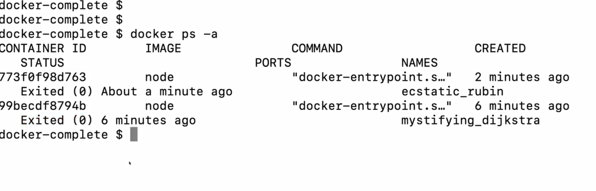
And yes, they are not running anymore but we could absolutely have two containers which are based on the same image up and running at the same point of time, simply by opening up multiple terminals and then while repeating this docker run command. This would absolutely be possible. And that's the idea behind images and containers. Images contain the code, the setup, the meet, you could say and containers are then the running instances of those images.

## 004 Our Goal A NodeJS App

The transcript begins by explaining that in most use cases, you don't just want to download and run an image that gives you an interactive shell like the Node image does. While this is useful to get started and to have an initial experience with containers and images, it's not all you want to do. Typically, you build upon those base images to create your own images. For example, you could build on the Node image to execute certain Node.js code with that image. This example is used throughout the course, but the same concept applies to other languages like PHP, GO, or Python, depending on the application you are building.

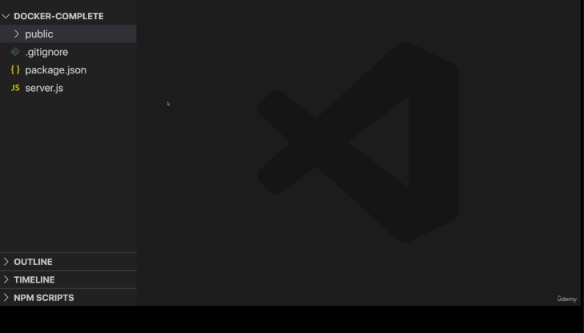

Usually, you pull an official base image and then add your code to it to execute your application within a container. This scenario requires you to build your own image because your specific application with your code will not exist on Docker Hub unless you upload it there. Therefore, the next step is to build an image based on the Node image.

To demonstrate this, a simple Node.js dummy project is provided, which can be downloaded. This project contains four files, including a `server.js` file that has the main Node application code. The `server.js` starts a web server with Node.js, listens on port 80, and handles incoming requests to different URLs. It processes GET requests to serve HTML and POST requests to store and display a goal value. The code retrieves a goal from the request body, logs it, sets a variable, and redirects to the main route to display the updated goal.

```js
const express = require("express");
const bodyParser = require("body-parser");

const app = express();

let userGoal = "Learn Docker!";

app.use(
  bodyParser.urlencoded({
    extended: false,
  })
);

app.use(express.static("public"));

app.get("/", (req, res) => {
  res.send(`
    <html>
      <head>
        <link rel="stylesheet" href="styles.css">
      </head>
      <body>
        <section>
          <h2>My Course Goal</h2>
          <h3>${userGoal}</h3>
        </section>
        <form action="/store-goal" method="POST">
          <div class="form-control">
            <label>Course Goal</label>
            <input type="text" name="goal">
          </div>
          <button>Set Course Goal</button>
        </form>
      </body>
    </html>
  `);
});

app.post("/store-goal", (req, res) => {
  const enteredGoal = req.body.goal;
  console.log(enteredGoal);
  userGoal = enteredGoal;
  res.redirect("/");
});

app.listen(80);
```

The project also includes a `public` folder containing a CSS file for styling, which is automatically loaded by the Node server when requested. Another key file is `package.json`, which describes the Node application and its dependencies, such as the Express framework and the body-parser package. These dependencies are necessary to run the Node application.

If you wanted to run the project locally without Docker, you would need to install Node.js, navigate to the project folder, and run `npm install` to download all required dependencies. After that, you could run the `server.js` file with the `node` command, which would start the server, allowing you to access the application on localhost at port 80 and interact with it.

However, since the course focuses on Docker, the next step is to quit the local server with `Ctrl + C`, clear the console, and delete the `node_modules` folder and `package-lock.json` file created after running `npm install`. This cleans up the local setup, and the project is returned to its initial state with only the core files.

```sh
npm install

// npm audit fix --force

node server.js

```

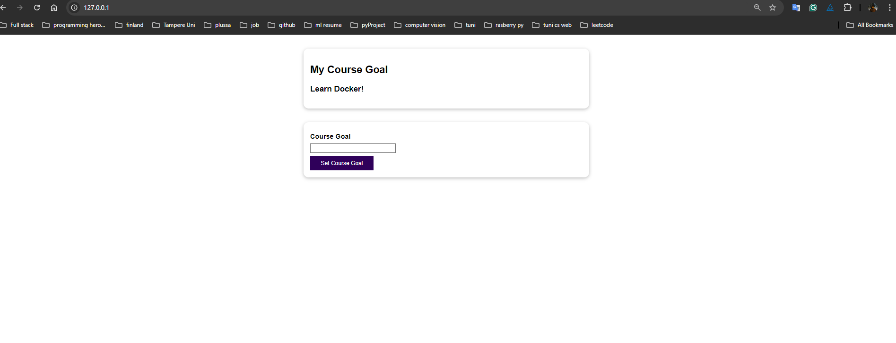

Finally, the goal is to use Docker to build an image containing this Node.js application. This image will also use the Node Docker Hub base image to run the application code. The `.gitignore` file included in the project is optional and is only important if using Git for version control. The overall goal is to dockerize this example Node.js application and run it in a Docker container.

- ctl + C and delete node_modules folder and package-lock.json file

## 005 Building our own Image with a Dockerfile

The transcript begins by explaining how to build a custom Docker image. You first need to go to the folder containing your code and create a new file named `Dockerfile`. This is a special name recognized by Docker. To get better support for writing Docker files, it's recommended to use Visual Studio Code and install the Docker extension, which will assist with writing Docker instructions. It's not a must-have, but it makes things easier.
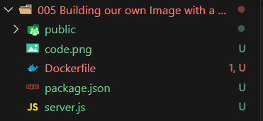

Next, the content discusses what to put into the Dockerfile. The file will contain the setup instructions for Docker to execute when building the image. Typically, you start with the `FROM` instruction in all caps. This allows you to build your image upon another base image. You could theoretically build an image from scratch, but usually, you want to start with an operating system or tool that your code needs. For this example, the image is built upon the Node image using `FROM node`.

Docker will pull the Node image either from the local system or from Docker Hub if it doesn't already exist locally. In this case, since the Node image was already used before, it exists on both Docker Hub and locally. This step tells Docker to start by pulling in the Node image and then continue with additional instructions.

The next step involves copying the files from the local machine into the image. This is done using the `COPY` command, with a simple instruction like `COPY . .`. The first `.` refers to the folder that contains the Dockerfile, and the second `.` represents the path inside the image where the files will be stored. Every image and container created from it has an internal filesystem, separate from your machine. It's recommended to use a subfolder instead of the root folder in the container, so here the path `/app` is used.

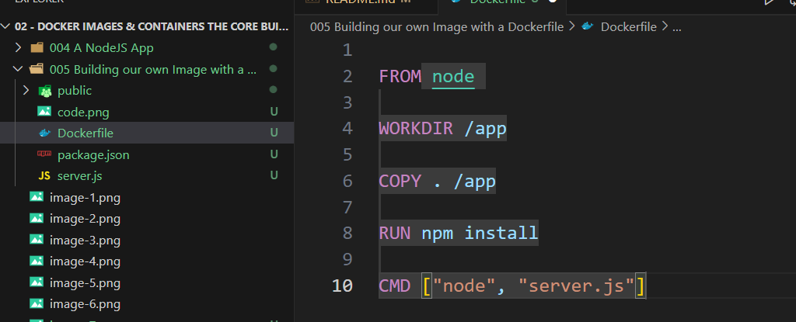

After copying the files, the `WORKDIR` instruction is set to `/app`, meaning all subsequent commands will be executed from this directory. This makes sure that `npm install`, which needs to be run next, is executed in the correct folder.

The `RUN` instruction is then used to execute `npm install` in the container to install the dependencies of the Node application. This is similar to running `npm install` outside of Docker to set up the project.

The difference between `RUN` and `CMD` instructions is also explained. The `RUN` command is executed during the image creation, while the `CMD` command is executed when a container is started based on the image. The `CMD` instruction is used to run the server when the container is launched: `CMD ["node", "server.js"]`.

The next important step is the `EXPOSE` instruction. Since the Node server listens on port 80, and Docker containers are isolated with their internal networks, `EXPOSE 80` is added to make this port accessible to the host machine when the container is run.

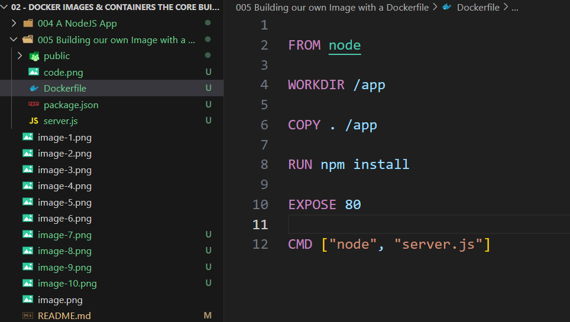

The Dockerfile now contains all the setup instructions for a Docker image. The content concludes by stating that the next steps are to see how to utilize this custom image, build it, and run it.

## 006 Run Container

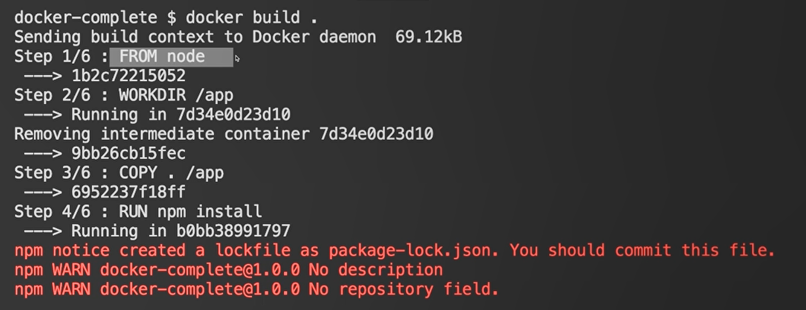

See how docke built id is running
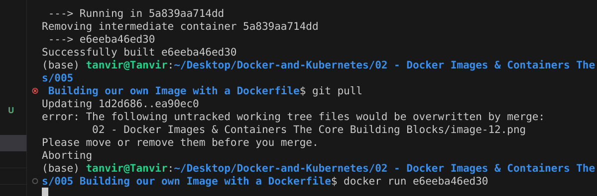

now if you try `docker ps `then you will se running docker
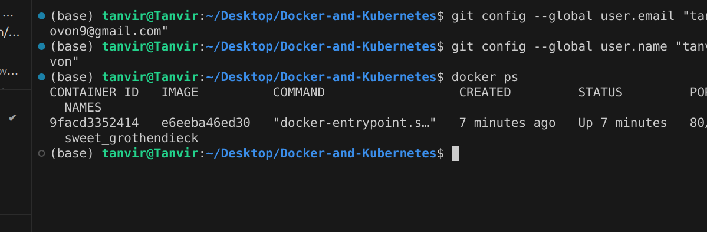

### how to stop docker ?

docker stop docker_name
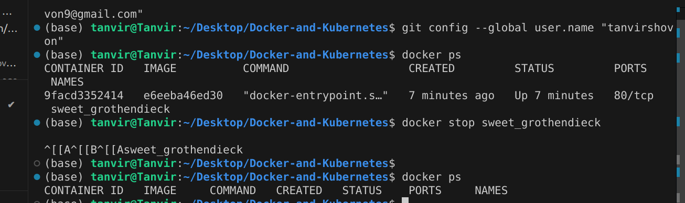
you can also check with command docker ps or docker ps -a

but still there is problem that port is not mentioned when docker run
here p is the port

```shell
docker run -p localhost_port:docker_port docker_id
```

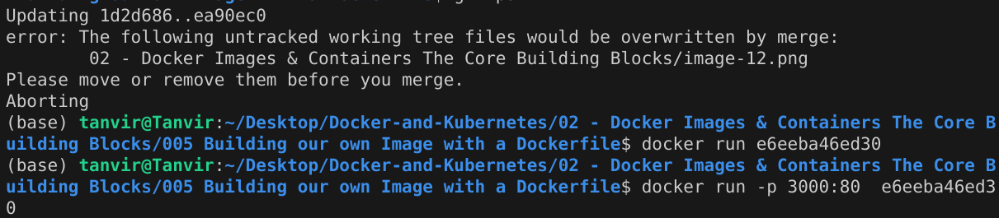
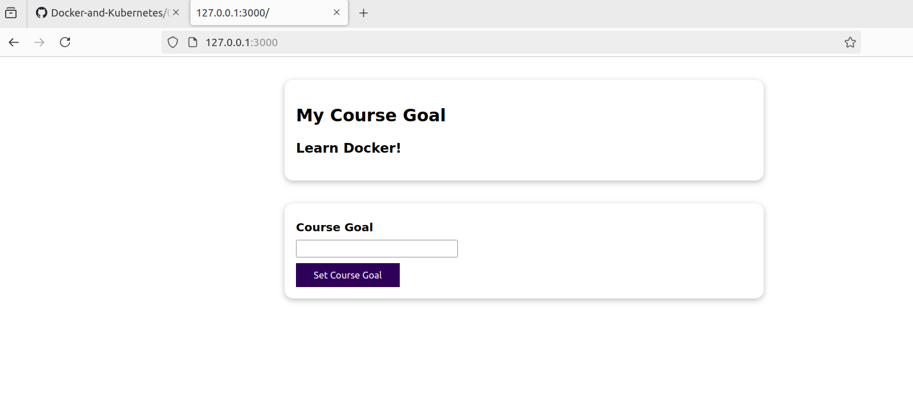
it is working

### 008 : images are read-only

if we copy the files from 005 and change the server.js where the html code are written. if we restart the docker , it will not show any update regarding this.

- now sort time solution is rebuild the docker again with code `docker build .`

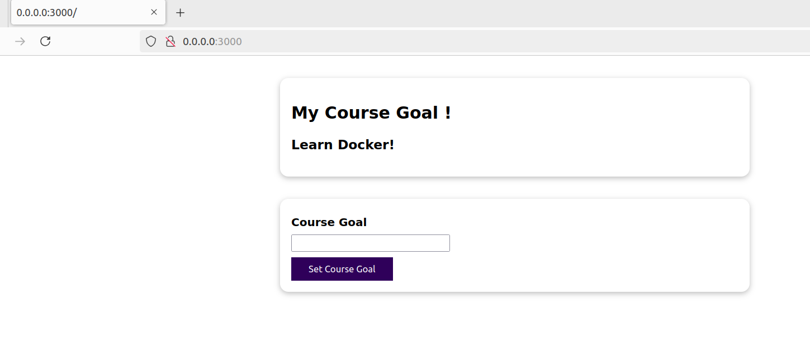
you can see the ! after my course goal header.

## 009 Understanding Image Layers

So an image is closed once we build it, once these instructions were executed. That's why we have to rebuild it if we need to update something in there, for example, when our code changed, and we wanna copy the new code into a new image, that's what we covered in the previous lecture.

Building up on that, there is another important concept related to images which you also should be aware of. They are layer based. Now what do I mean by that? With that, I mean that when you build an image, or when you rebuild it, only the instructions where something changed, and all the instructions thereafter are re-evaluated. Keep in mind that I changed the code, and then I rebuilt this image. We did this in the last lecture.

Now, I did not change the code again since then. So if I now rebuild this image again, by running Docker build dot, you see this is super fast. It finished in like a quarter of a second. It was super fast because we see all these using cache messages here. Because Docker basically recognized that for all these instructions, the result when the instructions are executed again will be the same as before. We have the same working directory, the code I copy has not changed at all, there is no new file, no file has changed, and therefore Docker is able to infer that it doesn't really need to go through that instruction again.

Instead, whenever you build an image, Docker caches every instruction result, and when you then rebuild an image, it will use these cached results if there is no need to run an instruction again. And this is called a layer-based architecture. Every instruction represents a layer in your Dockerfile. And an image is simply built up from multiple layers based on these different instructions. In addition, an image is read-only, which means once an instruction has been executed and once the image is built, the image is locked in and code in there can't change unless you rebuild the image, which technically means you create a new image. That's what I covered before.

But let's come back to these layers. And images are layer-based; every instruction creates a layer, and these layers are cached. If you then run a container based on an image, that container basically adds a new extra layer on top of the image, which is that running application, that running code, basically the result of executing the command which you specified in your Dockerfile. This adds the final layer, which only becomes active once you run an image as a layer.

All the instructions before that final instruction are already part of the image though as separate layers. And when nothing changes, all these layers can be used from cache. Now if I do change something in code, if I add more exclamation marks here or anything else, no matter what you change, if I now build this again, by repeating Docker build dot, you will see that now it takes longer because it only uses some results from cache. It used the work directory instruction result from the cache, but it noticed that for the copy instruction, it needs to run it again. Because it scans the files which it should copy in, and Docker detects that one file changed, and hence it copies in all files again.

Now, here's the thing. Whenever one layer changes, I said that all other layers are all rebuilt, Docker is not able to tell whether npm install would now yield the same result as before. After all, we copied in our files again, and Docker does not do a deep analysis of which file changed where and if this could affect npm install. So whenever one layer changed, all subsequent layers are also re-executed, which is why here npm install ran again.

So I hope this layer-based architecture makes sense and is clear. It exists to speed up the creation of images since Docker only rebuilds and re-executes what needs to be re-executed. And that's, of course, a very useful mechanism. Now it also means that at the moment, whenever we change anything in our code, we also run npm install again, even though we as a developer know that this is unnecessary. Unless we change something in package.json, which manages the dependencies of our project, there is no need to run npm install again, ever. Because if we just changed something in our source code, this has no impact on the dependencies this project needs, and therefore in Node's world, npm install does not need to be re-executed.

And here we have our first tiny bit of optimization potential for this Dockerfile. Instead of copying everything like this, and then running npm install, it would be better if we would copy this after npm install, but before we run npm install, we also copy the package.json file, and we copy that into the app folder. With that, we would pick up this package.json file, copy that into the app folder, then run npm install, and then copy over our other code. With this, we would ensure that this layer, the npm install layer, comes before we copy our source code. So in the future, whenever we change our source code, these layers in front of the copied source code command will not be invalidated. And npm install will not run again, just because we copied in our source code again.

So now only these layers would run again, and that will be more performant than running npm install again, which simply takes a certain amount of time to finish. I hope this makes sense. So if I now build this again, for the first time, it will run npm install and copy in everything, but then here we got our image name, and if we now use that to run our container, and we reload, we see this change in source code, of course, which I made before.

But if we now stop this container, first of all, with Docker stop, and then go to server js and update the source code again to remove all the exclamation marks again, you will notice that if I rebuild the image with Docker build dot, it's now again super fast because it was able to use the cached result from npm install. Because the steps prior to npm install didn't change, because Docker sees that the package.json file did not change, it's the same as before, and therefore there was no need to copy that again and to run npm install again. The only change happened in this step, but that comes after npm install.

- previous

```docker

FROM node

WORKDIR /app

COPY . /app

RUN npm install

EXPOSE 80

CMD ["node", "server.js"]

```

- after update

```docker

FROM node

WORKDIR /app

COPY package.json /app

RUN npm install

COPY . /app

EXPOSE 80

CMD ["node", "server.js"]

```

So that's the first small optimization, but more important than that optimization is that you understand why we are doing it and that you understand this layer-based approach, this layer-based architecture. It's really important because it's a core concept in Docker and Docker images, and it exists for the reasons outlined in the last minutes.

## 010 A First Summary

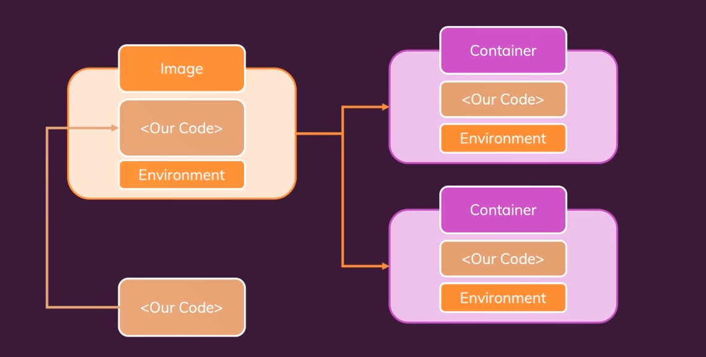

By now we explored the core concepts about Images and Containers. And I just want to provide a first summary, on those concepts to ensure we're all on the same page. With Docker, it's all about Our Code in the end. Our application we're building, for example our web application. We put that code that makes up our application, into a so called Image. And we don't just put Our Code in there, but also the Environment, the tools we need to execute that Code. You learned that you can create such an Image, by creating such a Dockerfile, where you provide detailed instructions, on what should go into the Image, which base image you might be using, which code and which dependencies should be copied in there, if maybe some setup step like npm install is required, and if you then want to open up some internal port, so that you can listen to that from outside of the imagined deal for ultimately outside of the container in the end.

And that's of course important. Docker ultimately is about containers, not images. But images are an important building block, they are the template, the blueprint for your containers. You can then instantiate, run multiple containers based on an Image. The Image is the thing that contains your Code and so on. The container as you learned is just an extra thin layer on top of the Image, but still the container in the end is your running application, based on an image, but then once it is running, standalone and independent from other containers that might be running.

I want to emphasize though, that a container does not copy over the code and the environment from the image into a new container into a new file. That is not what's happening. A container will use the environment stored in an image, and then just add this extra layer on top of it, this running node server process for example, and allocate resources, memory and so on to run the application, but it will not copy that code. So Our Code and the node environment, is not getting copied three times here. If we have one image and two containers, it exists only once in the image and two containers, then utilize that image and the code in it. This is how Docker manages this, and that's of course very efficient.

And that's the core idea behind Docker. Having those isolated environments that contain your app, and everything that is required to run that app, all the environment, all the tools like node js, and having all of that inside of this isolated container. That's what Docker is about, and that will be covered thus far, over the last lectures.

## 011 Managing Images & Containers

`docker --help`

```shell
Usage:  docker [OPTIONS] COMMAND

A self-sufficient runtime for containers

Common Commands:
  run         Create and run a new container from an image
  exec        Execute a command in a running container
  ps          List containers
  build       Build an image from a Dockerfile
  pull        Download an image from a registry
  push        Upload an image to a registry
  images      List images
  login       Log in to a registry
  logout      Log out from a registry
  search      Search Docker Hub for images
  version     Show the Docker version information
  info        Display system-wide information

Management Commands:
  builder     Manage builds
  container   Manage containers
  context     Manage contexts
  image       Manage images
  manifest    Manage Docker image manifests and manifest lists
  network     Manage networks
  plugin      Manage plugins
  system      Manage Docker
  trust       Manage trust on Docker images
  volume      Manage volumes

Swarm Commands:
  swarm       Manage Swarm

Commands:
  attach      Attach local standard input, output, and error streams to a running container
  commit      Create a new image from a container's changes
  cp          Copy files/folders between a container and the local filesystem
  create      Create a new container
  diff        Inspect changes to files or directories on a container's filesystem
  events      Get real time events from the server
  export      Export a container's filesystem as a tar archive
  history     Show the history of an image
  import      Import the contents from a tarball to create a filesystem image
  inspect     Return low-level information on Docker objects
  kill        Kill one or more running containers
  load        Load an image from a tar archive or STDIN
  logs        Fetch the logs of a container
  pause       Pause all processes within one or more containers
  port        List port mappings or a specific mapping for the container
  rename      Rename a container
  restart     Restart one or more containers
  rm          Remove one or more containers
  rmi         Remove one or more images
  save        Save one or more images to a tar archive (streamed to STDOUT by default)
  start       Start one or more stopped containers
  stats       Display a live stream of container(s) resource usage statistics
  stop        Stop one or more running containers
  tag         Create a tag TARGET_IMAGE that refers to SOURCE_IMAGE
  top         Display the running processes of a container
  unpause     Unpause all processes within one or more containers
  update      Update configuration of one or more containers
  wait        Block until one or more containers stop, then print their exit codes

Global Options:
      --config string      Location of client config files (default "/home/tanvir/.docker")
  -c, --context string     Name of the context to use to connect to the daemon (overrides DOCKER_HOST env var and default context set with "docker context use")
  -D, --debug              Enable debug mode
  -H, --host list          Daemon socket to connect to
  -l, --log-level string   Set the logging level ("debug", "info", "warn", "error", "fatal") (default "info")
      --tls                Use TLS; implied by --tlsverify
      --tlscacert string   Trust certs signed only by this CA (default "/home/tanvir/.docker/ca.pem")
      --tlscert string     Path to TLS certificate file (default "/home/tanvir/.docker/cert.pem")
      --tlskey string      Path to TLS key file (default "/home/tanvir/.docker/key.pem")
      --tlsverify          Use TLS and verify the remote
  -v, --version            Print version information and quit

Run 'docker COMMAND --help' for more information on a command.

For more help on how to use Docker, head to https://docs.docker.com/go/guides/
```

## 012 Stopping & Restarting Containers

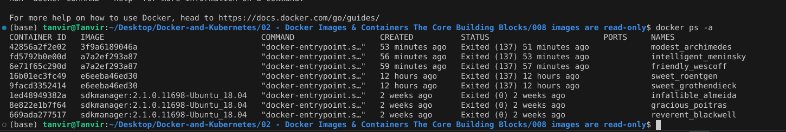
`docker ps -a`
this will show all docker which is running and not running. by using name we can run the docker again where i no need to imageid again. and also it will not block the terminal so we can give another command on a same terminal.
ere is the extracted text with commands highlighted:

Now I'm back in the demo project we worked on before, and I'll bring up that built-in terminal again. But you can of course also open up a default terminal outside of Visual Studio code. And there we got various commands which we can run with help of the Docker command. And as I mentioned, if you for example `run docker --help`, you get a list of the built-in main commands you can run with Docker. And you see there are quite a lot of commands there. Well, good news is a lot of these commands will not really matter to you in the vast majority of cases. There also are some commands from the past where we nowadays have better ways of achieving something. But still, you see we have quite a lot of commands here. You can obviously read these descriptions to see what these commands do, but it will come down to a couple of core commands you should be aware of. In addition, there also are some commands which also could be replaced by other commands executed differently. In general, with Docker for some operations you have multiple ways of performing that operation.

Now I wanna start with managing images and containers since that is what Docker is all about. And we already saw for example that you can list all containers by running `docker ps`. And this shows you all running containers by default. Now if you add -a, you see all containers you had in the past including the stopped containers which are not running anymore. As a side note, if you run `docker ps --help`, you see all available config options for docker ps. And here's the -a flag which we used to show all containers. So docker ps -a shows us all containers, including the containers we stopped. `And one important thing you can also do with Docker` is you can restart a stopped container.

You don't always need to docker run a new container, because that's important. With docker run, you create a new container based on an image, and that new container is started thereafter. Sometimes that is what you want but sometimes it's not. If nothing changed about our application, about the dependencies and our source code, and our image didn't change, there is no need to create a brand new container. We can just restart an existing container. And for that we can just search for stopped containers ` docker ps -a`. Now you might see a different output than I do here because I'm also working with these containers off screen, deleting some which we'll learn later and adding new ones. `But here you see my history of Docker containers` I worked with recently. And if nothing changed about our code `and about our Docker file`, we can just grab let's say this one, the most recent one which exited `and restart that with docker start`. If we run docker start and then the container ID or name, this will bring the container back up.

Now you'll see it starts the container in a different mode. `It's not blocking the terminal as it did with docker run`, but I can tell you this container is up and running. And you can verify by running `docker ps` without the -a flag to only see the running containers. And you should see this container here. And we can also visit localhost 3000 and reload there. And there our application is up and running, thanks to this restarted container. But again, as I mentioned, this restarted container is in this strange mode where, yes, it did start. But no, we're not really able to interact with it or to see the logs. Instead, it started this container and then returned to the terminal so that we could enter more commands. And as I mentioned, that's different to what docker run did.

## 013 Understanding Attached & Detached Containers

Here is the extracted text from the SRT file without numbering, timecodes, or missing any words:

Now, there is more we can do with the docker command than with containers and images. We already saw a couple of different commands and action, and I wanna come back to this mode which we have here when we restarted a container and the mode which we had when we initially started a container. Here, when we're restarting it, the process in our terminal here finished immediately. We're not attached to this running docker container in the terminal anymore. Nonetheless, it clearly is still running, as we can see with docker ps. So, this container is running, it's just not blocking us here in the terminal, and that's different compared to the docker run command we executed before.

If I run this again, binding to a different local port since 3000 is already used by the already running container, but if I use a different port here, I'm starting a new additional container based on the same image. So, therefore with docker ps in a different terminal here, we see we got two containers up and running now, but you see that for docker run, we're stuck in this process. I can't enter more commands here. I mean, I can type, but I can't commit them. I can't confirm them with enter. Instead, this process is blocking this terminal, and with docker start, that was not the case.

Now, this is not a blog or anything you have to accept. This is something you can configure if you wanna be in this attached mode or in detached mode. And it's just a case that for starting with docker start, the detached mode is the default; for running with docker run, the attached mode is the default. And now the question of course is which mode do you want and why does this even matter?

Well, in this example application, I am logging something to the console whenever we set a new goal. So, here if I add "Learn Docker in-depth!" as a goal on localhost 3000, that's my started container which was detached. We see nothing in the console anywhere. On the other hand, if I go to localhost 8000, which is that new container we ran with docker run, and I set my goal here, you will see that it also shows up in the terminal here because here we're attached to this running container, and attached simply means that we're listening to the output of that container, for example, to what's being printed to the console. And this might or might not be what we want.

We can also run a container in detached mode if we want to; we don't have to accept that default of being attached. For this, I'll quickly stop this more recent container which I started with docker stop, which will take a couple of seconds. So, that's the container we started with docker run, and once this is stopped, I will re-run it but now in detached mode by adding -d as an extra flag in front of the image ID here. If I now enter it, you see now I just get the ID, the automatically generated ID of the new container. You see with docker ps that we have this container up and running, that still shortened ID of that up and running container, by the way, and we see that container is running. And therefore visiting localhost 8000 also works.

But now if I add "Learn Docker in-depth!" for example here on localhost 8000, we don't see that log in the terminal where we executed docker run, because now we're not attached to the output since we used the -d flag to start in detached mode. The advantage is that we now can use one and the same terminal to also do other things.

If you still wanna look into your running container, you got two ways of doing that. For one, we can see with docker help that there is an attached command. So, we can attach ourselves again to a running container. We can simply find the container and use its name or its ID—both work—and then run docker attach and that name, and we are attached again. And therefore now, if we change it again and set a new goal, we do see this output again. So, that's one way of doing it.

But actually, let me stop this container again, and let me restart it thereafter now in detached mode automatically since that is the default for docker start. And let me show you another way of getting access to, for example, the log messages that are printed inside of a container. This is running again. If I now type "Learn Docker in-depth!" here and commit this, so I save this and set this goal, we don't see the goal because we are detached. And we could attach again to see future log messages, or another thing we can do, another useful command, is the docker logs command which fetches the logs that were printed by a container. And here we can first of all find the container—eloquent_brown is the name of the container I'm interested in here—and then we can run docker logs on that container, and we see the past logs that were printed by that container.

We can also, if we inspect the options of docker logs, enter follow mode by adding -f to keep on listening. So basically, we're now attaching ourselves again. So if I add -f here, we again get this attached process where we see future logs, future output by that container again. So, these are the different options we have for that. And I'm spending a lot of time on that because it is important that you understand the difference between a running and a stopped container, and an attached and a detached container. No matter if it's attached or detached, it's still up and running. But if you then need information from inside the container, you can use docker logs or attach yourself to the container again to get that extra information.

Now, with that I will again docker stop eloquent_brown to bring down that container and detach myself again here. Now, one last note about all of that: if you would want to restart a stopped container like eloquent_brown here in attached mode, right from the start, you can do so by adding the -a flag to the start command. Now, you start this in attached mode.

## 015 Entering Interactive Mode
- create `rng.py`
```python
from random import randint

min_number = int(input('please enter the min number: '))
max_number = int(input('please enter the max number: '))

if (max_number < min_number):
    print('invalid input - shutting down....')
else:
    rnd_number = randint(min_number,max_number)
    print(rnd_number)
```

interactive mode

```shell
(base) tanvir@Tanvir:~/Desktop/Docker-and-Kubernetes/02 - Docker Images & Containers The Core Building Blocks/015 Entering Interactive Mode$ docker run --interactive --t
--tmpfs  --tty    
(base) tanvir@Tanvir:~/Desktop/Docker-and-Kubernetes/02 - Docker Images & Containers The Core Building Blocks/015 Entering Interactive Mode$ docker run --interactive --tty cabd027e302b
please enter the min number: 4
please enter the max number: 5
4
(base) tanvir@Tanvir:~/Desktop/Docker-and-Kubernetes/02 - Docker Images & Containers The Core Building Blocks/015 Entering Interactive Mode$ docker ps
CONTAINER ID   IMAGE     COMMAND   CREATED   STATUS    PORTS     NAMES
(base) tanvir@Tanvir:~/Desktop/Docker-and-Kubernetes/02 - Docker Images & Containers The Core Building Blocks/015 Entering Interactive Mode$ docker ps -a
CONTAINER ID   IMAGE                                 COMMAND                  CREATED          STATUS                      PORTS     NAMES
6ee999e92731   cabd027e302b                          "python rng.py"          27 seconds ago   Exited (0) 19 seconds ago             dreamy_haibt
42856a2f2e02   3f9a6189046a                          "docker-entrypoint.s…"   2 hours ago      Exited (137) 2 hours ago              modest_archimedes
fd5792b0e00d   a7a2ef293a87                          "docker-entrypoint.s…"   2 hours ago      Exited (137) 2 hours ago              intelligent_meninsky
6e71f65c290d   a7a2ef293a87                          "docker-entrypoint.s…"   2 hours ago      Exited (137) 2 hours ago              friendly_wescoff
16b01ec3fc49   e6eeba46ed30                          "docker-entrypoint.s…"   13 hours ago     Exited (137) 13 hours ago             sweet_roentgen
9facd3352414   e6eeba46ed30                          "docker-entrypoint.s…"   13 hours ago     Exited (137) 13 hours ago             sweet_grothendieck
1ed48949382a   sdkmanager:2.1.0.11698-Ubuntu_18.04   "docker-entrypoint.s…"   2 weeks ago      Exited (0) 2 weeks ago                infallible_almeida
8e822e1b7f64   sdkmanager:2.1.0.11698-Ubuntu_18.04   "docker-entrypoint.s…"   2 weeks ago      Exited (0) 2 weeks ago                gracious_poitras
669ada277517   sdkmanager:2.1.0.11698-Ubuntu_18.04   "docker-entrypoint.s…"   2 weeks ago      Exited (0) 2 weeks ago                reverent_blackwell
(base) tanvir@Tanvir:~/Desktop/Docker-and-Kubernetes/02 - Docker Images & Containers The Core Building Blocks/015 Entering Interactive Mode$ docker start --a dreamy_haibt 
unknown flag: --a
See 'docker start --help'.
(base) tanvir@Tanvir:~/Desktop/Docker-and-Kubernetes/02 - Docker Images & Containers The Core Building Blocks/015 Entering Interactive Mode$ docker start -a dreamy_haibt 
please enter the min number: 4
6
7

7^C
(base) tanvir@Tanvir:~/Desktop/Docker-and-Kubernetes/02 - Docker Images & Containers The Core Building Blocks/015 Entering Interactive Mode$ docker ps -a
CONTAINER ID   IMAGE                                 COMMAND                  CREATED              STATUS                      PORTS     NAMES
6ee999e92731   cabd027e302b                          "python rng.py"          About a minute ago   Up 10 seconds                         dreamy_haibt
42856a2f2e02   3f9a6189046a                          "docker-entrypoint.s…"   2 hours ago          Exited (137) 2 hours ago              modest_archimedes
fd5792b0e00d   a7a2ef293a87                          "docker-entrypoint.s…"   2 hours ago          Exited (137) 2 hours ago              intelligent_meninsky
6e71f65c290d   a7a2ef293a87                          "docker-entrypoint.s…"   2 hours ago          Exited (137) 2 hours ago              friendly_wescoff
16b01ec3fc49   e6eeba46ed30                          "docker-entrypoint.s…"   13 hours ago         Exited (137) 13 hours ago             sweet_roentgen
9facd3352414   e6eeba46ed30                          "docker-entrypoint.s…"   13 hours ago         Exited (137) 13 hours ago             sweet_grothendieck
1ed48949382a   sdkmanager:2.1.0.11698-Ubuntu_18.04   "docker-entrypoint.s…"   2 weeks ago          Exited (0) 2 weeks ago                infallible_almeida
8e822e1b7f64   sdkmanager:2.1.0.11698-Ubuntu_18.04   "docker-entrypoint.s…"   2 weeks ago          Exited (0) 2 weeks ago                gracious_poitras
669ada277517   sdkmanager:2.1.0.11698-Ubuntu_18.04   "docker-entrypoint.s…"   2 weeks ago          Exited (0) 2 weeks ago                reverent_blackwell
(base) tanvir@Tanvir:~/Desktop/Docker-and-Kubernetes/02 - Docker Images & Containers The Core Building Blocks/015 Entering Interactive Mode$ docker ps
CONTAINER ID   IMAGE          COMMAND           CREATED              STATUS          PORTS     NAMES
6ee999e92731   cabd027e302b   "python rng.py"   About a minute ago   Up 14 seconds             dreamy_haibt
(base) tanvir@Tanvir:~/Desktop/Docker-and-Kubernetes/02 - Docker Images & Containers The Core Building Blocks/015 Entering Interactive Mode$ docker stop dreamy_haibt 
dreamy_haibt
(base) tanvir@Tanvir:~/Desktop/Docker-and-Kubernetes/02 - Docker Images & Containers The Core Building Blocks/015 Entering Interactive Mode$ docker start -a -i dreamy_haibt 
please enter the min number: 4
please enter the max number: 5
4
(base) tanvir@Tanvir:~/Desktop/Docker-and-Kubernetes/02 - Docker Images & Containers The Core Building Blocks/015 Entering Interactive Mode$ 

```
## 016 Deleting Images & Containers
after stopping docker you can remove docker
`docker rm docker_name`
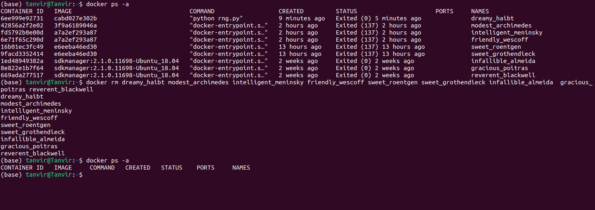

### How to remove docker images ?
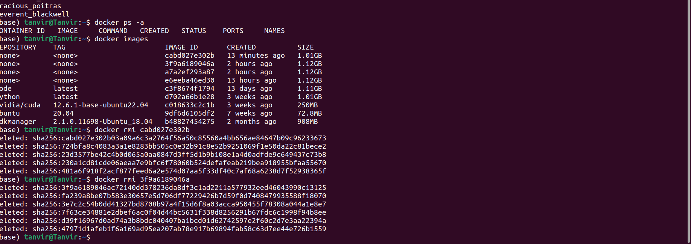

`docker image prune` command delete all unused images

## 017 Removing Stopped Containers Automatically

## 018 A Look Behind the Scenes Inspecting Images

## 019 Copying Files Into & From A Container

## 020 Naming & Tagging Containers and Images

## 021 Sharing Images - Overview

## 022 Pushing Images to DockerHub

## 023 Pulling & Using Shared Images

## 024 Module Summary
