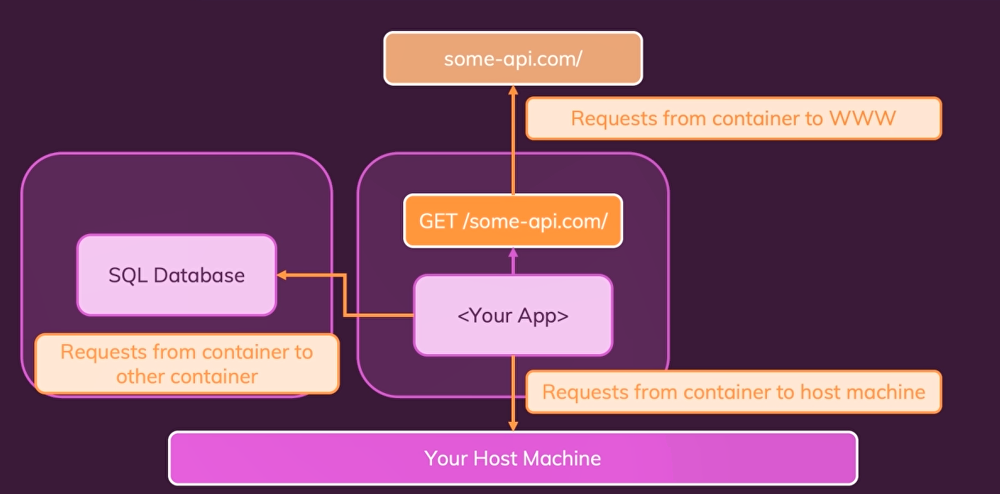
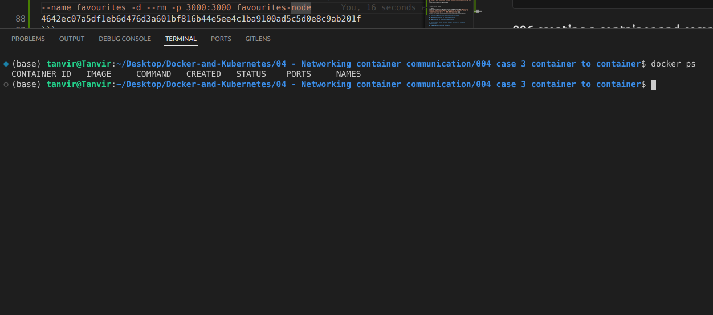

## 001 Intro

how to connect multiple containes !!

## 002 case 1 container to www communication


Now let's start by understanding what I mean when I say network and requests. And for this, let's assume that we have a container with our application inside of it, could be a Node application, could be a Python application, or a PHP application, it does not matter, and now let's say that this application, as part of its application logic, actually wants to talk to an API, so to some website out there in the World Wide Web. For example, to send data there or to fetch data from there, and just to make this clear here with this API website, I'm talking about a site not owned by us. So this is not another container or anything like that, it's just a website, a web API, to which your application might want to talk. It might want to send a GET HTTP request to this API, for example.

So this scenario here would be about sending a request, in this case, an HTTP request, from your container, so from the application running in a container to the World Wide Web. And I actually do have an example for this. Attached, you'll find another simple starting project. It's another Node.js application, but again, it's just an example. I tend to use Node.js a lot because I work with it a lot, but you could have any kind of application, but in this application, I'm doing something special. In there in this app.js file, which holds my application code, I am using Axios, which is a third-party package, which has also mentioned in package.json as a dependency. I'm using Axios to send a GET request to this Star Wars API here. And this is not an API created or owned by me. It's not a Docker container. It's a website in the end, a web API, which you can also visit.
https://swapi.dev/api/people
For example, swapi.dev/api/films will yield some data, some information about the Star Wars movies. So this is simply a dummy API, you could say, which we can use to play around with it in dummy demo applications, and that is the kind of application we have here. This application here will actually create another API, which then will live in a container later, but under the hood, this API, which I'm building here, will reach out to another API, this Star Wars API, to fetch movie and character data from there.

Now, I'll dig deeper into this example application in just a second, because we are going to work with it throughout this module, but I just want to highlight already that this is a Node application that sends an HTTP request to some other site, to some other website in this case, and therefore will definitely have HTTP communication between this app and this Star Wars API website. And that of course implies that if we put this Node app into a container, which we're going to do in this module, we need to ensure that this request can still be sent and that it can go from inside our container to outside the container. So that is one possible way of communicating in a dockerized app, sending an HTTP request to some other website or web API, which is out there.


## 003 case 2 container to local host machine communication


Now sending such an HTTP request to a website or web API is actually not the only kind of communication we could have in a dockerized app. Maybe we also have something on our hosting machine, some web service or a database, anything like that, and we wanna talk to that from inside our dockerized app. So we then still want to communicate with something outside of the container but something is not a website or anything like that, but instead it's a service running on our host machine. Just not a service in a network container, let's say, but simply a database, for example, which runs on our machine, just like that, totally without docker, we could also have this scenario.

And that's also something which we'll cover in this demo application which you find attached to the last lecture. There in this demo application, we do not just have code to talk to this Star Wars API. We also have code to fetch and store data in our own database. And therefore we also have code to connect to this database. In this case, we're going to use MongoDB, which is a quite popular database engine. You could say a database solution, which we can use, and we're going to connect to a Mongo database here which runs on our host machine and disdain for mean that.

```js
mongoose.connect(
  "mongodb://localhost:27017/swfavorites",
  { useNewUrlParser: true },
  (err) => {
    if (err) {
      console.log(err);
    } else {
      app.listen(3000);
    }
  }
);
```

This demo project here, this demo application which we're building with Node JS, needs to be able to talk to a database, which is not running in a container, but on my host machine, just like that. So communicating from inside your container, from inside your containerized application I should say, to some other service running on your host machine, that is definitely another scenario of communication between a container or a containerized app and something outside of that container. In this case, the host machine.

## 004 case 3 container to container communication


Now, besides the two kinds of communication, the two kinds of requests you could say, I already talked about, container to worldwide web and container to host machine, there is one other form of communication you could encounter in your Dockerized app and that would be that your application running inside of your container wants to talk to another container. Let's say we have another container with a sequel database inside of it. Could all the be container with a Mongo DB database in a DOE or any aggro container, which is running some service to which you want to talk from inside your other container.

So in this case, our application in the middle container might want to talk to this sequel database in another container. So communication between multiple containers is also a quite common scenario and in general, building applications with multiple containers is quite common. Up to this point in this course, we always worked with one container, right? We dockerized one pipe snap or one note app because we always had very simple application steer. Now, even though the demo app we're going to use in this module is also still quite simple, it's at least a bit more complex because here we actually, will have a great example, a great use case, a great scenario, where we might want to use multiple containers.

Because with Docker containers, it is strongly recommended and the best practice that every container should just do one main thing. So if you have a note application, which also needs a Mongo DB database, it is a recommendation and the best practice that your note application, so does app JS file and all the required dependencies and Alden and models folder, which belongs to this app, go into one container and one image and your Mongo DB database uses another image and runs in another container. This is a best practice, and we're going to learn way more about multi-container apps throughout this course. But this here is already a first example and therefore this example as well as most applications you're going to build with Docker, will typically need cross-container communication and that will therefore be another form of communication and of networking, which we're going to take a closer look at in this module.

## 005 analyzing the demo app
build the docker with docker command
`docker build -t favourite-node .`
```shell
 01-Intro.pdf
 Anaconda3-2024.06-1-Linux-x86_64.sh
 anydesk_6.3.2-1_amd64.deb
 code_1.90.0-1717531825_amd64.deb
'CTI-L4T-TX2-32.7.5-V001(1).tgz'
 CTI-L4T-TX2-32.7.5-V001.tgz
'David A. Forsyth, Jean Ponce - Computer vision_ A modern approach (2011, Prentice Hall) - libgen.li.pdf'
 e3Compose1.1.pdf
'geteduroam(1).exe'
 geteduroam.exe
 imager_1.8.5_amd64.deb
 lecture_notes.pdf
 nvidia
 postman-linux-x64.tar.gz
 sdkmanager_2.1.0-11698_amd64.deb
 sdkmanager-2.1.0.11698-Ubuntu_18.04_docker.tar.gz
 VNC-Viewer-7.12.0-Linux-x64.deb
 vs.deb
(base) tanvir@Tanvir:~/Downloads$ sudo apt-get install postman-linuxpostman-linux-x64.tar.gz
[sudo] password for tanvir: 
Reading package lists... Done
Building dependency tree... Done
Reading state information... Done
E: Unable to locate package postman-linuxpostman-linux-x64.tar.gz
E: Couldn't find any package by glob 'postman-linuxpostman-linux-x64.tar.gz'
E: Couldn't find any package by regex 'postman-linuxpostman-linux-x64.tar.gz'
(base) tanvir@Tanvir:~/Downloads$ 

```
- then run the docker 

```shell
(base) tanvir@Tanvir:~/Desktop/Docker-and-Kubernetes/04 - Networking container communication/004 case 3 container to container$ docker run --name favourites -d --rm -p 3000:3000 favourites-node
4642ec07a5df1eb6d476d3a601bf816b44e5ee4c1ba9100ad5c5d0e8c9ab201f
```
problem : no container show . even if we remove `-d`. it will crash due to no connection of mongo db !!

but if we comment the mongodb code then it will work finely!!
## 006 creating a container and communicaiton to web

## 007 making container to host communication

## 008 container to container communication

## 009 Introduce docker networks elegant container to container communicaiton

## 010 How Docker resolved Ip address
